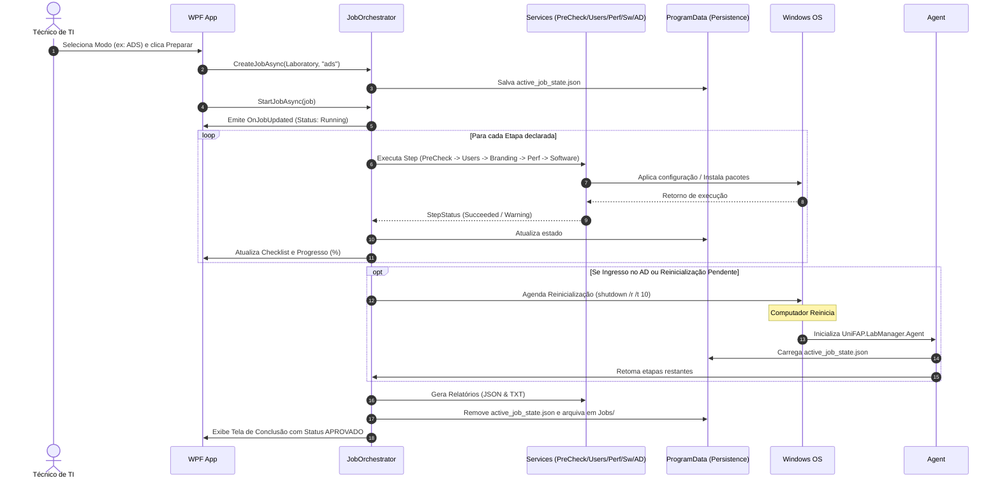

# Arquitetura do Sistema — UNIFAP LAB MANAGER

## 1. Visão Arquitetural

O **UNIFAP LAB MANAGER** adota o padrão de arquitetura em camadas (**Layered Architecture**) com estrita separação de responsabilidades e desacoplamento através de Injeção de Dependências (`Microsoft.Extensions.DependencyInjection`).

```text
┌────────────────────────────────────────────────────────┐
│                   APRESENTAÇÃO (UI)                   │
│          WPF (XAML) + MVVM + Temas Dinâmicos          │
│                (UniFAP.LabManager.App)                 │
└──────────────────────────┬─────────────────────────────┘
                           │ Consome ViewModels e Serviços
┌──────────────────────────▼─────────────────────────────┐
│                 CAMADA DE APLICAÇÃO                    │
│   JobOrchestrator • PreCheckService • SoftwareEngine   │
│    ActiveDirectoryService • Diagnostics • Reporting    │
│              (UniFAP.LabManager.Services)              │
└──────────────────────────┬─────────────────────────────┘
                           │ Utiliza Contratos
┌──────────────────────────▼─────────────────────────────┐
│                 DOMÍNIO & CONTRATOS                    │
│    Entidades (Job, Step, Software) • Interfaces DTO   │
│                (UniFAP.LabManager.Core)                │
└──────────────────────────┬─────────────────────────────┘
                           │ Acessa Implementações
┌──────────────────────────▼─────────────────────────────┐
│               CAMADA DE INFRAESTRUTURA                 │
│ ProcessRunner • PowerShellRunner • Winget • WMI • Reg │
│            JobPersistenceStore • MaskedLogger          │
│           (UniFAP.LabManager.Infrastructure)           │
└──────────────────────────┬─────────────────────────────┘
                           │
┌──────────────────────────▼─────────────────────────────┐
│              SISTEMA OPERACIONAL WINDOWS 11            │
│       Processos • Registro • Active Directory • WMI    │
└────────────────────────────────────────────────────────┘
```

---

## 2. Responsabilidades dos Projetos

### 2.1 `UniFAP.LabManager.Core`
- **Enums**: Estados de jobs (`JobStatus`), etapas (`StepStatus`), gravidade de erros (`SoftwareSeverity`), tipos de instaladores (`SoftwareType`).
- **Modelos**: `Job`, `JobStep`, `SoftwareItem`, `LaboratoryProfile`, `PreCheckReport`, `DiagnosticsReport`, `PreparationReport`.
- **Contratos**: `IJobOrchestrator`, `IPreCheckService`, `ISoftwareService`, `IWingetService`, `IActiveDirectoryService`, `IWindowsConfigurationService`, `IUserService`, `IPerformanceService`, `IBrandingService`, `IDiagnosticsService`, `IReportService`, `ILogService`, `IConfigService`, `ISecurityService`.

### 2.2 `UniFAP.LabManager.Infrastructure`
- **`ProcessRunner`**: Execução assíncrona não bloqueante de executáveis e scripts, captura de linhas de saída em tempo real e controle de timeout.
- **`PowerShellRunner`**: Execução isolada com `-NoProfile -NonInteractive -ExecutionPolicy Bypass` e parsing de JSON estruturado.
- **`WingetRunner`**: Gerenciador de pacotes oficial da Microsoft com aceitação silenciosa de termos e tratamento de códigos de reboot (3010).
- **`WmiAdapter`**: Consultas via WMI/CIM de CPU, RAM, disco e rede.
- **`RegistryAdapter`**: Manipulação segura do registro com gravação de snapshot para reversão (rollback).
- **`JobPersistenceStore`**: Gerenciamento de estado de jobs ativos e histórico em `C:\ProgramData\UniFAP\LabManager\`.
- **`MaskedLogManager`**: Mascaramento regex em tempo real de senhas e tokens antes da gravação em disco.

### 2.3 `UniFAP.LabManager.Services`
- **`JobOrchestrator`**: Motor sequencial de preparação, disparo de etapas, máquina de estados e integração com retomada pós-reinicialização.
- **`PreCheckService`**: Validação de hardware, espaço, elevação administrativa, DNS e conectividade com o DC antes do início.
- **`ActiveDirectoryService`**: Pré-checagem de LDAP/DNS e ingresso no domínio com isolamento de credencial em memória volátil.
- **`SoftwareEngine`**: Roteamento dinâmico para Winget, instaladores locais, scripts `.bat`/`.ps1` e legado.
- **`PerformanceService`**: Otimizações seguras preservando ClearType e efeitos visuais do Windows 11.
- **`UserService`**: Provisionamento de contas locais `suporte` (Admin) e `aluno` (Standard).
- **`BrandingService`**: Aplicação de papel de parede institucional e dados de suporte OEM.
- **`DiagnosticsService`**: Bateria de auditoria de sistema com detecção de falhas e dicas de resolução.
- **`ReportService`**: Emissão de relatórios em JSON e TXT com carimbo institucional.

### 2.4 `UniFAP.LabManager.App`
- Interface WPF moderna com paleta UniFAP (Dark e Light).
- Navegação fluida via sidebar e troca dinâmica de DataTemplates sem travar a thread principal (Dispatcher).
- Modo de simulação **Dry Run** que permite validar os planos de execução sem alterar a máquina.

### 2.5 `UniFAP.LabManager.Agent`
- Executável leve autônomo acionado no boot do Windows para verificar se existe um Job pendente em `C:\ProgramData\UniFAP\LabManager\active_job_state.json`.
- Retoma a partir da etapa interrompida e finaliza o processo sem intervenção humana.

---

## 3. Fluxo de Dados e Ciclo de Vida do Job


